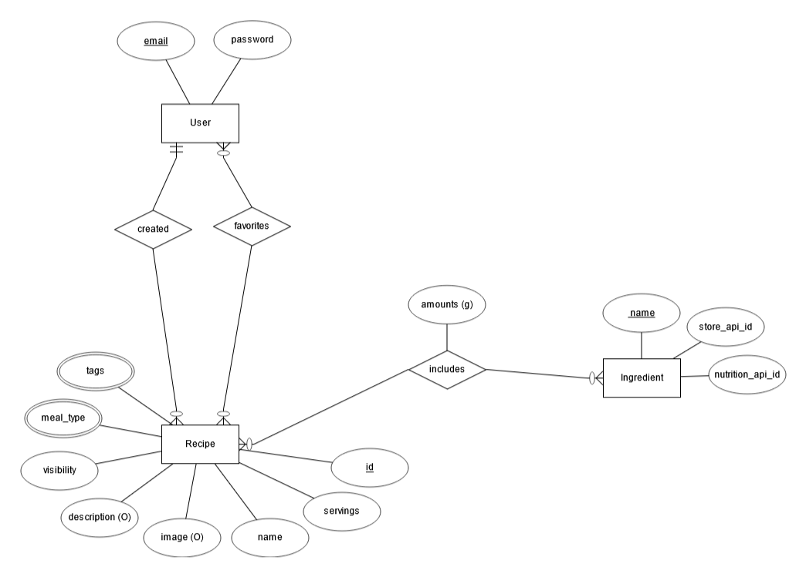

# **Smart Cart**
### Team Info
Nicholas Graalum - Team Lead - Front/back Software Developer- graalumn@oregonstate.edu  
Matthew Sasten - Frontend Software Developer, Backend Tester - sastenm@oregonstate.edu  
Andrew Chan - Software Developer, Backend Tester - chanand@oregonstate.edu  
Kylan Jagels - Software Developer, Frontend tester- jagelsky@oregonstate.edu  
Ryan Messenger - Frontend Software Developer, Backend Tester - messengr@oregonstate.edu  
Aaryan Raghuvanshi - Backend Software Developer, Frontend test- raghuvaa@oregonstate.edu  
### Communication
Discord  
Guidelines: Try to respond to discord messages within 3 hours, or at most by the end of the day

GitHub: https://github.com/NicholasGraalum/CS362-Project

### Abstract
With a busy week and having little time to plan, meals and food become a back of the mind problem. Balancing time and meal management is something that many people struggle with and causes people to ignore healthy foods as an option. Smart Cart is a free meal planning website that offers ease of use and constant availability. Allowing users to see what others post and add to the meal database. 

Consider the choices of meal preparation, costs of meals and where to shop for groceries. With this we have decided to go ahead with developing a Smart Grocery List Generator. An app that creates grocery lists based on meal plans and dynamically adjusts based on user preferences and budget constraints. Users will be able to search for meals or get recommendations of meals from a database of meals entered by other users. This app is perfect for those who need extra help organizing and planning their week ahead. 

### Goal
Our team goal is to develop a Smart Grocery List Generator that will help users plan their shopping trip to save them time and money by allowing them to plan ahead of going to the store, and giving them meal options to help them plan their meals instead of going out to eat. Our team will ensure that our goal is met by providing an already plentiful list of a variety of dishes including vegan food, healthy food, and many more options while also allowing users to add meals that anybody can see, ensuring that there are meals for everyone. We also plan to better help manage their money by providing many different options with varying prices for any items the user searches on our store page. By allowing users to plan from their home and go to the store with a list of everthing they will need, we will save them time so they don't need to search if an ingredient is present at their local Kroger store and thinking about what they need, as well as lowering the chance of impulse buys for non-neccessary items as they might when they stroll around normally.   
### Current Practice
There are apps on the store currently that do many things that we do. For example Karma is an extention that helps users compare prices and track sales. Other apps liks Whisk generate a shopping list that dynamically updates as you place meals in your cart. While these and many others are great apps currently that many users like, many of them costs money and there isn't an all in one product that combines these features for users to easily handle their shopping. 
### Novelty
Our website's novelty is the fact that this is a one stop shop where users can meal plan and generate a shopping lists all in one. As mentioned above, there are different apps that cover different features, but there are no products currently that do it all in one so users won't have to move through different apps.. With this app shopping will be a breeze and no grocery will be forgotten again. 
### Effect
Overall the user base is aimed towards consumers of large grocery based companies. As well as people who struggle or need a way to help budget their spendings on food while keeping a meal plan. Through our product, we expect to see users spend less time at grocery stores by coming in with a prepared list, spend less on eating out through our meal functionalities, and have a clearer view to see what they will spend and make any adjustments based on what they want to spend.

### Use Cases
User can create a profile and login to save their data 
- **Actors**: The user
- **Triggers**: Clicks “Login / Sign-Up” button
- **Preconditions**: The user must have a unique email address and username
- **Postconditions**: The user creates and logs in to a unique profile
- **List of steps**: User navigates to login/sign-up, provides credentials, the system creates an account, then the user has access to their profile.
- **Extensions**: User updates profile/username after logging in
- **Exceptions**: Invalid login details, already existing email, a bug or system failure occurs

User can view ingredients, number of servings, and a description for each meal 
- **Actors**: The user
- **Triggers**: Clicking on a meal
- **Preconditions**: Must be on the page showing the meals and the user wants to see how many calories and macronutrients are in each meal prep per serving
- **Postconditions**: Redirects to a new page showing the ingredients, number of servings, description, picture, and tags.
- **List of steps**: Add a listener to each meal that redirects to a meal template, the meal template takes information from the meal database, the page is rendered
- **Extensions**: Add a pie chart showing the percentages of each macronutrient, add a hidden dropdown showing the micronutrients and percentage of daily values
- **Exceptions**: The meal requested may not have all the needed information (shouldn’t happen if we have input verification)

User can add meals to a database of recipes 
- **Actors**: The user
- **Triggers**: The user clicks on “Create Meal” button 
- **Preconditions**: The user must have an account with our site
- **Postconditions**: The user adds a recipe to our pre-existing database of recipes
- **List of steps**: User logs on and adds a recipe which the user can click on and add to their shopping list the next time they use our site.
- **Extensions**: User adds a small info paragraph about possible substitutions
- **Exceptions**: User has a missing input such as, a list of ingredients or the name of the recipe

User can create a shopping list based on meals in the database
- **Actors**: The user
- **Triggers**: The user clicks add to the shopping list on the meal they want/ searched for.
- **Preconditions**: The user must have an account, there must be meals in the DB
- **Postconditions**: The ingredients of the meal added will appear in the shopping list.
- **List of steps**: In the meal page the user selects a meal of interest and clicks the “add to shopping list” button.
- **Extensions**: The user searches for  meals in the meal page via the search bar and adds it. The user adds a meal via the recommendations page. 
- **Exceptions**: The user adds incorrect meals to the shopping list. They search for a meal that doesn’t exist in the DB.

User can search for specific types of meals 
- **Actors**: The user
- **Triggers**: Clicking the ‘Apply Filter’ button
- **Preconditions**: All meals are shown on the page, the user wants to search by certain specifications (meal type, name, categories)
- **Postconditions**: The page is updated to only show the meals that satisfy the given filter suggestions
- **List of steps**: Add listener to ‘Apply Filter’ button, created algorithm to add or remove meals from DOM based on filter conditions
- **Extensions**: User updates or clears the filter conditions then correct meals are shown based on the new conditions
- **Exceptions**: If there are no meals in the database that match the filters, no meals will be shown

Users can add favorite meals to make it easier to find frequently bought ingredients
- **Actors**: The user
- **Triggers**: User clicking the star button on a single meal page
- **Preconditions**: User is logged in
- **Postconditions**: Meal is added to the user's favorite meals in the database and can be found by clicking the "Favoirites" button on the main meal page.
- **List of steps**: User clicks star button, the meal is added to the database as a favorite meal, the user can then find their favorite meals by clicking the "Favorites" button.
- **Extensions**: User can remove meals from their favorites list
- **Exceptions**: None

  Users can add misc. ingredients/products not part of any meal
- **Actors**: The user
- **Triggers**: User clicking the store button in the dropdown menu and searching for an ingredient/product.
- **Preconditions**: User is logged in
- **Postconditions**: Ingredient/product is added to the user's shopping list
- **List of steps**: User clicks store button, searches for a product/ingredient they want to add to their list, and then it is added to the shopping list.
- **Extensions**: User determine how much of the product/ingredient to add to their shopping list.
- **Exceptions**: Product/ingredient is not available on the Kroger API.

Ask for meal recommendations (Updated to be tentative stretch goal per TA recommendation)
- **Actors**: The user
- **Triggers**: The user clicks the meal recommendation button
- **Preconditions**: The user has entered a meal recommendation request prompt describing what type of meal they want
- **Postconditions**: A generated response is displayed including a few meal suggestions from the database and information about those meals.
- **List of steps**: User goes to the meal request page. User enters an appropriate meal request and clicks the request button. Gpt api generates a list of suggested meals. 
- **Extensions**: The user leaves the page before clicking the request button: entered request is not saved.
- **Exceptions**: The request prompt is not understood by the gpt ai: a default response is given with instructions for a correct prompt

### Functional Requirements:
1. System provides a way for users to create an account or log in with their credentials
2. System allows adding meals while storing all meals added
3. System filters meals based on user input (name, meal type, and category tags)
4. System provides an accurate price of the shopping list
5. System allows users to add meals to their favorites list
6. System allows users to add misc. ingredients or products to their shopping list

### Non functional Requirements:
**Reliability**: Consistently able to perform the functions based around the users profile, shopping lists, and meal plans.   
**Scalability**: Can handle multiple API requests without a performance decrease. Uses an sql database to store data so it can easily be scaled up.  
**Usability**: Has a responsive, clear design that gives users feedback on actions.  
**Security**: Stores user data in a secure manner
**Maintainability**: The codebase is modular, well-documented, and follows industry best practices, ensuring that it can be easily updated, extended, and maintained over time without introducing errors.
### External Requirements
**Error handling**: Invalid user inputs and actions are handled gracefully.  
**Access**: Run on a server with a public URL that others can access  
**Documentation**: Document the process for setting up the server so new servers can be created.  
**Scope**: The scope of our project extends to a reasonable use case for each member to implement. 
### Technical Approach / Toolset
#### High Level Solution
Smart Cart is going to be a website that users will be able to access after downloading and running our product as described in the SETUP documentation. Once users run our product, they will need to sign up or sign in. After signing in with an existing account or the one they just created. They can view the user documentation on the landing page or go through our functionalities. They can go to meals to add meals to their list or add meals to the database, they can go to list to view their current grocery list and see an estimated price, or they can go to the store page to add indivudual ingredients to their list.
#### Toolset
*Stack*:
- For the stack of our software, we will be using HTML, CSS and javascript. These are the industry standard for developing a stack and web based applications. Furthermore these three tools are what the team is most comfortable with.

Server:
- When it comes to the server position of our software we will be using Node, express and handlebars. Again these are the industry standard for developing a server for web based applications. This also offers a lot of flexibility for our application.

Database:
- Our database for the software will be mysql, as that is the only resource that we know of at the moment. Another thing is that this is the database toolset that we have used the most. 

APIs:
- We will be using one API for our software: the Fredmeyer  API giving us the ability to show the prices and items at the specific store. This is a part of the general basis of our software. If we are able to we would like to add some more store APIs that are public domain to give more offering of price and items.
### Team roles
Team lead:
- Nick: This role is needed due to the increase in need of organization and coherence within the team. Nick fills this role due to his monitoring and use of organizational programs, as well as his communication with the team.

Frontend developer / backend tester:
- Importance: To create a well designed front end of the webpage and to make a UI that is easy to use and comprehend. As well as help test and improve the backend functionality of the webpage.  
- Matthew: Has experience with web development for front end
- Ryan:  Has experience with web development for front end

Backend developer / frontend tester:
- Importance: Make a fast and well integrated API and database usage for the web page. Furthermore help test and improve the frontend design and functionality of the website.
- Kylan: Has experience with backend development and using APIs. 
- Andrew: Has experience with web development for back end and using APIs
- Aaryan: Has experience with web development for back end and using APIs

Schedule under roles:

|Role|Week 4|Week 5|Week 6|Week 7|Week 8|Week 9|Week 10|
|--------|--------|--------|--------|--------|--------|--------|--------|
|Front end developer A|Finish HTML| |EH HTML| |Finish F-JS|EH F-JS|Final adjust|
|Front end developer B| |Finish CSS| |EH CSS|Finish F-JS| |Final adjust|
|Back end developer A|Food API| |Food Handles| |EH Meal| |Final adjust|
|Back end developer B|Meal API| |Meal Handles| |EH Food| |Final adjust|
|Back end developer C|Profile API| |Profile Handles| |EH Profile| |Final adjust|
|Front end tester||Test HTML|Test CSS| | |Test F-JS| |
|Back end tester||Test Profile API|Test Meal API|Test Food API||||

### External feedback
Feedback will be most useful for testing our UI to make sure it is user friendly and intuitive. We will get this feedback by finding potential users and performing user tests.  
### Risks
1. APIs: 
- Risk: We plan to use multiple api’s that we have never used before. We could struggle with retrieving the data from the api or the api could not have the data we expected/required.
- Mitigation: We will look into the api’s early on, learn how to use them, and make sure they will work for what we need. 
2. Server setup:
- Risk: We plan to have our website hosted on a server which comes with uncertainties such as uptime and teammates familiarity with developing on live servers.
- Mitigation: We will research the best way to host the server ahead of time and make sure all teammates know how to push and test code on the server.  
3. Item code Integration issues:
- Risk: We will have different team members working with different apis that use different codes to refer to items. This could cause issues matching items when we try to connect all of our features with one database.
- Mitigation: We will come up with a system to match item codes across apis and within our own database before getting too far into development.
4. Meal Data and Creation:
- Risk: With many users, it is possible that a user or multiple users will create many fake meals that clutter our database and make it hard for users to find actual meals
- Mitigation: We will need to implement some way to check for real meals or have a team that checks meals inputted and verify them 

### Major features:
1: Users can create profiles and create any meals (breakfast, lunch, dinner, or snack) to a Database of recipes that others have contributed too. 
- Searches or adds to database of recipes
- Get recommendation of recipes based on user’s dietary restrictions and likes
- Recipes can be added to a list of favorite recipes.
2: Can create a shopping list based on meals in the following week in addition to other
groceries.
- Users can list what meals they plan to eat each day. Then ingredients for each meal are
automatically added to the shopping list. Users will need to determine how much of an ingredient they would need to buy
3: Give the total cost of a meal or the total cost of a shopping list
- Uses the store api to calculate costs

### Stretch goals:
1: Map/route for shopping at your local store
- Uses kroger api to get location of items in store
- Maps most efficient route
- Question: can we get the layout of the store?

2: Add additional store options (more than just Kroger)
- Requires us finding more public store api or web scraping 
### Overall Timeline
By week
- 1 and 2: project proposal and requirements elicitation 
- 3: begin architecture and design specifications 
- 4: finish specifications and set up groundwork for implementation. 
- 5: begin initial implementation
- 6: finish initial implementation 
- 7: Testing and fixes
- 8: beta release and final improvements
- 9 and 10: project finalization and final release/demo

2 week sprints:
1. Basic UI and functionality, including user friendly UI and setting up a database for profiles. 
2. Using the API’s to create meal plans and grocery lists based on budget and diet. 
3. Comparing plans and lists and implementing AI for meal suggestions and maybe more.

## Software Architecture
### Architecture Pattern:
**Layered architecture pattern (or model/view/controller)**   
we basically described model/view/controller architecture. It might make more sense to just call it that 
- **Presentation layer: (view)** web interface hosted on website     
  - Communicates to the business layer through http requests.   
- **Business layer: (controller)** backend server handling https request routing, executes necessary computations or API calls, renders on server side replies with html page.  
  - Communicates to Application layer by importing and calling database access functions
  - Alternative: REST API and client side rendering.  
    - Client side rendering is better for dynamic interfaces and reduces server load
    - We chose server side rendering because we are more familiar with it, it is simpler, and our interfaces will not require many dynamic aspects.   
- **Application layer: (models)** Data access layer (DAL) implements all necessary functions to access data so there are not SQL calls throughout program  
  - Communicates to data layers through MySQL ip by sending sql queries.  
- **Data layer:** MySQL database   
  - Alternative: NoSQL database like mongoDB  
    - NoSQL databases are more flexible   
    - We chose SQL database because it is better for structured data and queries and we are more familiar with using SQL databases.   

**Assumptions:**
- The server side is a monolith including business layer and application layer: routing functions, computation functions, and data access functions divided into files and imported where needed. 
- SQL injection security is implemented through data access layer
- Logged in users are handled by session variables. 
- Handlebars server side rendering is sufficient for our interface. 

### Components:

#### Web Pages (presentation layer)
1. **Main interface**: Displays the header, sidebar, and base layout. 
a. ‘Meals’ button will redirect to a page with all of the meals  
b. ‘Ingredients’ button will redirect to a page with individual ingredients to add to the shopping list  
c. ‘Shopping List’ button will redirect to a page with all items added to the shopping list and total cost.  
d. Additional buttons: login/logout, profile 
2. **All meals page**: Displays all available meals on individual cards with a picture and name. 
a. Each photocard will direct to an individual meal page displaying information about the meal. A ‘+’ button on the card will add all ingredients to the shopping list.  
b. Filter feature: Pop-up modal that shows filter conditions to search by (name, meal type, category tags, meal type).  
c. ‘Create Meal’ button: Pop-up modal with input fields to create a new meal and add it to the database. Must validate input.   
3. **Single meal page**: Displays information about the meal (name, description, image, number of servings, meal type, category tags, macronutrients, ingredients) and a ‘+’ button.  
4. **Ingredients page**: Displays all available ingredients on individual cards with a picture, name, and ‘+’ button.
a. ‘+’ button: Adds all ingredients to shopping list.  
b. Filter bar to search for specific ingredients.  
5. **Shopping list page**: Displays all ingredients added to cart and the estimated total cost.  
a. ‘-’ button on each ingredient: allows the user to remove ingredients from the shopping list.  
b. ‘+’ button on each ingredient: allows the user to increase the amount of the ingredient.  

7. Profile page (tentative)
8. Login/logout

#### Express routing (business layer)
- Local hosted server that takes http requests.
- Each page listed in the web pages component will have a corresponding http request function 
- The one exception is that the login page and landing page will be the same page, routed differently depending on if logged in.

#### computation functions (business layer)
- Grocery list price calculator function: calls Kroger api to calculate total price for all items on list. 

#### DAL (data access layer)
- Functions to pull data for a specific entry in users, meals, or ingredients. 
- Function for pulling meals with specific meal tags.
- Function for pulling ingredients in a meal. 
- Function for pulling meals favorited by user. 

#### Data Base (data layer):

ER Diagram:

Attribute specifications:
- Recipe aka Meal plan  
-- Name (varchar(20))  
-- Image (link)  
-- Number of servings (float)  
-- Meal type (multivalued: breakfast, lunch, dinner) (varchar(20))  
-- Category tags: (multivalued: vegan, vegetarian, gluten free, etc.) (varchar(20))   
-- Ingredients (relation)  
-- Visibility (public or private)  
-- Description (varchar(200))  
- User  
-- Email (varchar(100))  
-- Password (varchar(100))  
-- Profile info (Tentative. Might add profile info later)  
- Ingredients   
-- Name (varchar(100))  
-- Store_api_id (item id in kroger api) (int)  

  
### Software Design

#### webpages (presentation layer)

Handlebars (technically on server): main handlebar template will include the header, sidebar, and base layout for every page. Partial templates will be used to render the subpages using data from the database.  

#### Server (business layer)

Express routing to serve html pages rendered from handlebars to client. Routing functions are responsible for handling calling other necessary functions for computing, calling DAL functions or FDC nutrition API and Kroger API to collect necessary data, and rendering html page with data and handlebars. 

#### Data access layer

We will use the mysql2 library to send sql queries to access the data from MySQL. We will start by implementing functions to return data for each table and add additional functions as necessary. This will allow anyone working on the program to easily access data, even if they aren't familiar with the database.

#### Database specifications (data layer)
DataBase service:  
MySQL: This will be used to make the database for the meals and ingredients. We are most comfortable with this service.
Responsibilities: respond with data when receiving SQL query requests.

### Coding Guidelines
All of these guidelines were taken from the google AI overview, slightly modified to stay inline with how our group operates. These all best fit our group as web development requires a lot of cross referencing with variable names and attributes. We can keep a consistent naming convention and system to all our code to better communicate and avoid common errors. Furthermore having language specific guidelines for functionality can help the team avoid loading times and keep a consistent mindset for the product.

#### General Formatting:
- Use two spaces for each indentation level  
- Add line breaks after opening and closing tags for better readability
- Avoid leaving trailing spaces at the end of lines
- Use UTF-8 character encoding
- Use camel case
- Write clear comments
#### HTML(Handlebars):
- Use lowercase for all HTML element names
- Enclose attribute values in double quotes
- Do not include a value for boolean attributes
- Use semantic elements when appropriate
#### CSS:
- Prioritize more specific CSS selectors
- Use lowercase for all CSS property names
- Use shorthand properties where possible
- Use hex color codes for consistency
#### JavaScript(Express):
- Organize code into logical modules and functions, avoid deep nesting.
- Implement error handling to prevent crashing
- Aim to write code that uses minimal resources and is efficient
- Use meaningful variable, function and class names.

### Process Description
#### Risk Assessment:

| Risk                     | Likelihood | Impact | Evidence                                                | Mitigation                                        | Detection                                             | Plan                                                                 |
|--------------------------|------------|--------|--------------------------------------------------------|--------------------------------------------------|-----------------------------------------------------|----------------------------------------------------------------------|
| API Integration Issues   | High       | High   | Limited experience with Kroger APIs                    | Early exploration of the API with testing        | API testing                                         | Fallback to a static data set if the API fails                       |
| Team Communication Issues | Low        | High   | Reliance on online communication                      | Set response expectations and standup meetings regularly | Track responses and activity from each member     | Team lead will reach out individually if there are any problems      |
| User Scalability         | Low        | High   | API calls have a certain daily and monthly limit      | Upgrade API plan to be able to handle more calls | Track our user count and our growth                | Once we reach a certain number of users that approach API limits, upgrade the plan |
| DB Issues               | Low        | High   | Anticipated rapid growth in the recipe data           | Optimize queries, with indexes                   | Monitor performance and scale                       | Implement scalable database infrastructure                            |
| Document Organization    | Medium     | Medium | Between seven members and lots of files, keeping consistent code and variable tracking can be messy | Proper documentation and frequent communication | Code starts to get messy to read, duplicate function or variable declaration | Draw out our design plan, designate roles with no conflicts         |

Our risks are now more specific to our project, with more issues related to both team and software potential shortcomings.

#### Project Schedule

| Milestone                                      | Tasks                                               | Effort         | Dependencies               |
|------------------------------------------------|-----------------------------------------------------|---------------|----------------------------|
| **Week 4: Finish Architecture**               | Finalize architecture and design                   | 2 person-weeks | None                       |
| **Week 5: Initial Implementation**            | Implement basic UI and backend                     | 2 person-weeks | Architecture complete      |
| **Week 6: API Integration**                   | Integrate needed APIs                              | 2 person-weeks | Backend setup complete     |
| **Week 7: Testing and Improvements**          | Unit and integration testing                       | 1 person-week  | Initial implementation complete |
| **Week 8: Implement Needed Changes & Stretch Goals** | Deploy testing results and work on outstanding features/goals | 1 person-week  | Testing complete           |
| **Week 9-10: Final**                          | Address feedback and finalize project/presentation | 2 person-weeks | Testing complete           |

#### Team Structure
**Team Lead:** Nicholas Graalum (oversees progress, coordinates tasks).  
**Frontend Developers:** Matthew Sasten, and Ryan Messenger (UI design and implementation)  
**Backend Developers:** Andrew Chan, Aaryan Raghuvanshi, and Kylan Jagles (API integration, DB management).  
**Testers:** All members cross-testing  
Any available member is available to help and test wherever needed along the way as well.  

#### Test Plan and Bugs
Track all bugs on **GitHub Issues**  
**Functional Requirements:**
  - **Unit Testing:** Verify shopping list price calculation functions. Test rendering of individual handlebars by hardcoding data in the test. Verify data access models pull correct data. 
  - **Integration Testing:** Test interactions between components (Verify all HTTP requests and API calls render)  

  - **Validation Testing:** Check that pages satisfy the requirements by checking the html response for required data 
  - **System Testing:** End to End testing to check that the system works as a whole by using the Cypress library to write a test to simulate user flow through the website.
 
  - **Bug Tracking:** Use GitHub Issues to log and resolve bugs.  

**Non-Functional Requirents:**
  - **Responsiveness:** Measure server response time, especially for actions requiring API calls
  - **Scalability:** Measure our SQL query response time on large datasets

#### Documentation plan
Developer living documentation and guides for future development. This will include code structure and architecture. Implemented as we develop new features
User guide documentation. This will go over all the UI and different features and how to use them. Implemented at the end of development and as new features are implemented
In-app information symbols and explanations. This will explain in the app how to do different things and use different features. Implemented during development and from user feedback.

#### Test-Automation and CI 
We will be using Mocha as our test automation infrastructure along with the Chai, Supertest, and Cypress libraries. We chose Mocha because its flexibility allows testing synchronous functions, asynchronous functions, testing our http routes using Supertest, and simulating user flow through the website with Cypress. Developers can add new tests by adding to the /test folder and using the existing tests as examples. 

We are using GitHub Actions for continuious integration. Every time a pull request is made or a change has been commited, The GitHub action event will be called, before getting the code from the repo, downloading dependencies, and running the mocha tests cases. This happenes through the /.github/workflows folder with the YAML script. 

**Pros of GitHub Actions**
- Built directly into GitHub, making setup and maintenance easier. No need for an extra service.
- Pre-made workflow templates for a variety of products.

**Cons of GitHub Actions**
- Less detailed log output for debugging
- Longer start time compared to other dedicated CI services

**Pros of CircleCI**
- Dedicated CI system that is faster than GitHub actions
- Optimized for CI/CD efficiency

**Cons of CircleCI**
- Requires more set up configurations

### Reflections

#### Aaryan:

#### Andrew:
- I learned that proper documentation and planning is needed for a successful project because just getting started on the implementation gets messy quickly
- I learned that frequent communication with your team is important because everybody should know where the project stand and what are the next plans of action for a successful project
- I learned that starting early is important because there will always be conflicts and unexpected events that come up that slow your team down and provide troubles

#### Kylan:
- I learned that tasks should be specifically assigned to individuals instead of just put on the trello because then they are more likely to get completed.  
- I learned that small deadlines should be set for smaller parts of a larger task otherwise the task will be rushed at the very end of the deadline.  
- I learned that its important to plan and set specific requirements for a task as a team so that the team is on the same page and everyone has the same understanding of what needs to be done. 

#### Matt:

#### Nick:

#### Ryan:
